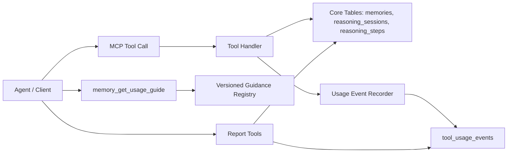
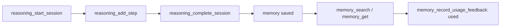

# Memory MCP Guidance And Telemetry Design

> **Status**: Draft
> **Last updated**: 2026-07-06
> **Created by**: Codex
> **Primary sources**: `src/db.ts`, `src/migrations/index.ts`, `src/migrations/*.ts`, `src/tools/memory.ts`, `src/tools/reasoning.ts`, `src/schemas/reasoning.ts`, `AGENTS.md`, runtime data in the local SQLite database
> **Overall confidence**: Medium
> **Version**: v0.1

## 1. Goals

Design a versioned usage-guidance layer and a minimal telemetry layer for `memory-mcp-server`, so that:

- an agent can ask the MCP itself how to use the tools for the current task context;
- the maintainer can measure the real behavior of each agent, client, and MCP version;
- adoption effectiveness can be compared across versions;
- `AGENTS.md` is no longer the only source of guidance;
- no prompts, full inputs/outputs, or unnecessary sensitive data are stored.

## 2. Context and Evidence

### 2.1 Current storage state

The current schema is applied through the migration runner in `src/migrations/index.ts`. `src/db.ts` only opens SQLite, enables pragmas, and calls `runMigrations(db)`. The current DB consists of these main data groups:

| Table | Role | Evidence |
|---|---|---|
| `schema_migrations` | Tracks applied migrations | `src/migrations/index.ts` |
| `memories` | Stores durable memories | `src/migrations/0001_initial.ts` |
| `reasoning_sessions` | Stores reasoning session lifecycle | `src/migrations/0001_initial.ts` |
| `reasoning_steps` | Stores individual steps within a session | `src/migrations/0001_initial.ts` |
| `reasoning_step_marks` | Stores audit marks for reasoning steps | `src/migrations/0002_reasoning_step_marks.ts` |
| `reasoning_steps_fts` | FTS index for searching reasoning steps | `src/migrations/0003_reasoning_steps_fts.ts` |

There is currently no dedicated table for tool-call telemetry, guidance versions, the adoption funnel, or usage events.

### 2.2 Current agent-guidance state

`AGENTS.md` currently contains the flow that guides agents in using the MCP. This is a useful improvement inside this repo, but it is not sufficient as a long-term source of truth because:

| Problem | Impact |
|---|---|
| Workspace-dependent | An agent using the MCP from another repo may not be able to read it, or may not have the same `AGENTS.md` |
| Drifts across versions | Tool behavior changes but guidance in old repos does not update itself |
| Not machine-readable | Agents struggle to pick a flow automatically when the guidance is prose only |
| Effectiveness unmeasurable | No way to know whether agents actually follow the guidance |

### 2.3 Current behavior-measurement state

By observing the runtime DB before telemetry existed, some behavior can be inferred from `reasoning_sessions` and `reasoning_steps`, but it cannot be measured fully:

| Behavior | Measurable today? | Reason |
|---|---:|---|
| A session is opened | Yes | Row exists in `reasoning_sessions` |
| A step is added | Yes | Row exists in `reasoning_steps` |
| A memory is saved | Yes | Row exists in `memories` |
| `memory_search` is called | No | Read-only calls leave no dedicated event |
| `memory_list` is called | No | Read-only calls leave no dedicated event |
| A tool call fails | Not fully | Errors are only returned in the response; no event is stored |
| Which version an agent uses | No | No `mcp_version` in any event |
| Whether a memory is recalled and actually used | No | No usage event after search/get |

## 3. Problem Statement

The MCP currently offers memory and reasoning tools, but agents only see tool names, schemas, and descriptions. Without a versioned workflow living inside the MCP itself, agents merely "know the tools exist" without reliably knowing when to use which tool.

At the same time, the maintainer has no canonical place to observe usage behavior per agent and per MCP version. Inferring from the `memories` or `reasoning_sessions` tables is not enough, because read-only tools and tool errors leave no durable trace.

## 4. Design Principles

1. The MCP describes how to use itself.
2. Guidance must be versioned and machine-readable.
3. Telemetry stores only minimal metadata, never full prompts or full payloads.
4. Every event must be local-first and work with the existing SQLite setup.
5. Do not break existing tool contracts.
6. Reporting must answer the adoption questions before any dashboard is added.
7. Metrics must distinguish agent, client, and MCP version.
8. Keep the implementation small; do not turn the MCP into an analytics platform.

## 5. Scope

### 5.1 In Scope

| Item | Description |
|---|---|
| Versioned guidance | A tool/resource for agents to ask how to use the MCP for a task context |
| Usage events | A table storing minimal events for tool calls |
| Adoption reports | Read-only tools aggregating funnels and behavior per agent/version |
| Agent scorecard | A report comparing how each agent uses the MCP |
| Privacy guardrails | Rules on what data may and may not be stored |
| Migration plan | Additive schema so old DBs upgrade safely |

### 5.2 Out Of Scope

| Item | Exclusion reason |
|---|---|
| Dashboard UI | Not needed before report tools exist |
| Cloud sync | The MCP is local-first |
| Vector search | Not directly related to telemetry/guidance |
| LLM scoring of memory quality | Adds complexity and data risk |
| Full prompt logging | Bad for privacy and unnecessary for measuring adoption |
| Automatically correcting agent behavior | The MCP guides and measures; it does not control the agent runtime |

## 6. Target Architecture



The architecture has four layers:

| Layer | Role |
|---|---|
| Core memory/reasoning | Keeps existing tools and existing tables unchanged |
| Versioned guidance | Returns a short, versioned workflow per task context |
| Usage telemetry | Records minimal events per tool call |
| Reporting | Aggregates adoption, errors, recall, and behavior per agent/version |

## 7. Tool Surface

### 7.1 New tool: `memory_get_usage_guide`

Purpose:

- Let the agent ask the MCP how to use its tools for the current task.
- Return short, structured, versioned output.
- Reduce dependence on `AGENTS.md`.

Expected input:

| Field | Type | Required | Notes |
|---|---|---:|---|
| `task_type` | enum | Yes | `trivial`, `investigate`, `implement`, `debug`, `review`, `planning`, `handoff`, `unknown` |
| `agent_id` | string | No | The calling agent/persona |
| `client_name` | string | No | Codex, Claude, custom agent |
| `client_version` | string | No | Client version if available |
| `mcp_version` | string | No | If the client knows the version in use |
| `has_prior_context_query` | boolean | No | Whether the agent already has a concrete query for searching memory |
| `is_sensitive_task` | boolean | No | Whether the task involves sensitive data or secrets |

Expected output:

| Field | Type | Description |
|---|---|---|
| `guide_version` | string | Version of the guidance |
| `mcp_version` | string | MCP version serving the guidance |
| `recommended_flow` | string[] | Short, machine-readable list of steps |
| `first_tool` | string \| null | The tool to call first |
| `required_tools` | string[] | Tools to use if the flow continues |
| `avoid_tools` | string[] | Tools to avoid in this context |
| `save_policy` | object | When to save/skip a memory |
| `telemetry_notice` | string | Reminder that the call may be recorded as a metadata event |

Example output:

```json
{
  "guide_version": "2026-07-05.v1",
  "mcp_version": "1.1.0",
  "recommended_flow": [
    "memory_search if prior context could change the answer",
    "reasoning_start_session before multi-step investigation",
    "reasoning_add_step only for meaningful decisions or observations",
    "reasoning_complete_session at the end",
    "save durable conclusions unless memory_mode is never"
  ],
  "first_tool": "memory_search",
  "required_tools": ["reasoning_start_session", "reasoning_complete_session"],
  "avoid_tools": [],
  "save_policy": {
    "default": "save_completed_durable_conclusion",
    "skip_requires_reason": true
  },
  "telemetry_notice": "This MCP stores tool usage metadata, not full prompts or full payloads."
}
```

### 7.2 New tool: `memory_usage_report`

Purpose:

- Aggregate tool usage by agent, client, MCP version, and time.

Expected input:

| Field | Type | Required |
|---|---|---:|
| `agent_id` | string | No |
| `client_name` | string | No |
| `mcp_version` | string | No |
| `date_from` | ISO date/time | No |
| `date_to` | ISO date/time | No |
| `group_by` | enum | No |
| `limit` | number | No |

Supported `group_by`:

- `tool_name`
- `agent_id`
- `client_name`
- `mcp_version`
- `operation_type`
- `status`
- `day`

Expected output:

| Field | Description |
|---|---|
| `summary` | Total events, success rate, error rate |
| `groups` | Aggregate table per `group_by` |
| `top_errors` | Normalized error codes/messages |
| `time_range` | The data range covered |

### 7.3 New tool: `memory_adoption_report`

Purpose:

- Measure the memory adoption funnel and reasoning completion.

Required metrics:

| Metric | Description |
|---|---|
| `reasoning_started` | Sessions opened |
| `reasoning_completed` | Sessions completed |
| `reasoning_abandoned` | Sessions abandoned |
| `zero_step_sessions` | Sessions with 0 steps |
| `completed_with_memory` | Completed sessions that created a memory |
| `completed_without_memory` | Completed sessions that created no memory |
| `skip_reason_count` | Skips counted per reason |
| `memory_saved` | Memories created |
| `memory_searched` | search/list/get calls |
| `memory_recalled` | Memories appearing in search/get results |
| `memory_updated` | Memory curation events |

Expected output:

| Field | Description |
|---|---|
| `funnel` | Conversion rates between steps |
| `agent_breakdown` | Breakdown per agent |
| `version_breakdown` | Breakdown per MCP version |
| `risk_flags` | Anomaly indicators |

### 7.4 New tool: `memory_agent_scorecard`

Purpose:

- Let the maintainer see how each agent is using the MCP.

Expected output per agent:

| Field | Description |
|---|---|
| `agent_id` | Agent/persona |
| `sessions_started` | Sessions opened |
| `sessions_completed` | Sessions closed |
| `avg_steps_per_session` | Average trace depth |
| `save_rate` | Share of completed sessions with a memory |
| `search_rate` | Level of memory-retrieval usage |
| `reuse_rate` | Whether saved memories get recalled again |
| `error_rate` | Tool error rate |
| `dominant_behavior` | E.g. `reasoning-heavy`, `memory-light`, `balanced`, `noisy` |
| `recommendations` | Suggestions for improving behavior |

### 7.5 New tool: `memory_record_usage_feedback`

Purpose:

- Let the agent or client record minimal feedback after a memory/search result was used.
- This is how `memory_search -> memory_used` is measured, instead of only knowing that a search returned results.

Expected input:

| Field | Type | Required | Notes |
|---|---|---:|---|
| `memory_id` | string | Yes | The memory that was used |
| `event_id` | string | No | The related search/get event |
| `agent_id` | string | No | The agent that used the memory |
| `usefulness` | enum | Yes | `used`, `ignored`, `irrelevant`, `stale`, `unsafe_to_use` |
| `reason` | string | No | Short reason, must not contain secrets |

Expected behavior:

- Record an event with `operation_type='feedback'`.
- Do not modify the memory content.
- Do not require full task context.

## 8. Data Model

### 8.1 New table: `tool_usage_events`

Suggested columns:

| Column | Type | Required | Description |
|---|---|---:|---|
| `id` | TEXT PRIMARY KEY | Yes | Event id |
| `created_at` | TEXT | Yes | ISO timestamp |
| `agent_id` | TEXT | No | Agent/persona |
| `client_name` | TEXT | No | Codex, Claude, custom |
| `client_version` | TEXT | No | Client version |
| `mcp_version` | TEXT | Yes | MCP version |
| `guidance_version` | TEXT | No | Guidance version if any |
| `tool_name` | TEXT | Yes | The tool called |
| `operation_type` | TEXT | Yes | `memory`, `reasoning`, `guidance`, `report`, `feedback` |
| `access_type` | TEXT | Yes | `read`, `write`, `delete`, `derived` |
| `status` | TEXT | Yes | `success`, `error`, `skipped` |
| `error_code` | TEXT | No | Normalized error |
| `latency_ms` | INTEGER | No | Processing time |
| `session_id` | TEXT | No | Related session |
| `step_id` | TEXT | No | Related step |
| `memory_id` | TEXT | No | Primary related memory |
| `related_event_id` | TEXT | No | Link to a prior event |
| `input_shape` | TEXT | No | Sanitized JSON metadata |
| `output_shape` | TEXT | No | Sanitized JSON metadata |
| `metadata` | TEXT | No | Minimal JSON object |

Suggested constraints:

| Constraint | Reason |
|---|---|
| `status IN ('success','error','skipped')` | Normalizes reporting |
| `access_type IN ('read','write','delete','derived')` | Distinguishes side effects |
| `operation_type IN (...)` | Groups behavior |

Suggested indexes:

| Index | Purpose |
|---|---|
| `(created_at)` | Time filtering |
| `(agent_id, created_at)` | Per-agent reports |
| `(mcp_version, created_at)` | Version comparison |
| `(tool_name, created_at)` | Tool usage reports |
| `(status, created_at)` | Error reports |
| `(session_id)` | Join with reasoning |
| `(memory_id)` | Join with memory |

### 8.2 New table: `guidance_versions`

Suggested columns:

| Column | Type | Required | Description |
|---|---|---:|---|
| `version` | TEXT PRIMARY KEY | Yes | Guidance version |
| `mcp_version` | TEXT | Yes | Bundled MCP version |
| `content_hash` | TEXT | Yes | Hash of the guidance content |
| `created_at` | TEXT | Yes | Creation date |
| `status` | TEXT | Yes | `active`, `deprecated` |
| `metadata` | TEXT | No | JSON metadata |

Note: v1 can hardcode the guidance in code and only expose `guide_version`; this table is only needed when guidance must be inspectable/historized in the DB.

### 8.3 New table: `memory_usage_feedback`

Two options:

| Option | Description | Recommendation |
|---|---|---|
| Reuse `tool_usage_events` | Store feedback as events with `operation_type='feedback'` | Recommended for v1 |
| Dedicated table | Optimizes feedback-specific queries | Add only when feedback queries get complex |

V1 should use `tool_usage_events` to keep the schema small.

## 9. Event Taxonomy

### 9.1 Operation Types

| operation_type | Tools |
|---|---|
| `memory` | `memory_save`, `memory_search`, `memory_list`, `memory_get`, `memory_update`, `memory_delete` |
| `reasoning` | `reasoning_start_session`, `reasoning_add_step`, `reasoning_get_trace`, `reasoning_list_sessions`, `reasoning_mark_step`, `reasoning_search_steps`, `reasoning_list_milestones`, `reasoning_get_session_outline`, `reasoning_complete_session` |
| `guidance` | `memory_get_usage_guide` |
| `report` | `memory_usage_report`, `memory_adoption_report`, `memory_agent_scorecard` |
| `feedback` | `memory_record_usage_feedback` |

### 9.2 Input Shape Rules

`input_shape` does not store the full input. Only sanitized attributes are stored:

| Tool | input_shape should store |
|---|---|
| `memory_search` | query length, query term count, filters present, limit |
| `memory_save` | content length, type, tag count, importance |
| `memory_update` | updated fields list, patch vs replace |
| `reasoning_add_step` | fields present, text lengths |
| `reasoning_mark_step` | mark_type, note present, note length |
| `reasoning_search_steps` | query length, token count, filters present, limit |
| `reasoning_list_milestones` | filters present, limit |
| `reasoning_get_session_outline` | session_id present |
| `reasoning_complete_session` | status, memory_mode, saved/skipped |
| `memory_get_usage_guide` | task_type, agent_id present, client_name |

### 9.3 Output Shape Rules

`output_shape` stores summaries only:

| Tool | output_shape should store |
|---|---|
| `memory_search` | result count, has_more, returned ids hash/list optional |
| `memory_list` | result count, has_more |
| `memory_get` | found/not found |
| `memory_save` | memory_id, type, tag count |
| `reasoning_start_session` | session_id |
| `reasoning_mark_step` | step_id, mark_type, note present |
| `reasoning_search_steps` | result count |
| `reasoning_list_milestones` | result count, has_more |
| `reasoning_get_session_outline` | used_fallback, step count |
| `reasoning_complete_session` | memory_id present, not_saved_reason category, warning count |
| report tools | row count, date range |

## 10. Reporting Semantics

### 10.1 Adoption Funnel



Primary funnel metrics:

| Funnel Step | Formula |
|---|---|
| Start to complete | `completed_sessions / started_sessions` |
| Complete to memory | `completed_with_memory / completed_sessions` |
| Memory recall | `memories_recalled / memories_saved` |
| Recall usefulness | `feedback_used / recalled_memories` |
| Trace depth | `avg(reasoning_steps per session)` |
| Compliance-only sessions | `zero_step_sessions / started_sessions` |

### 10.2 Version Comparison

Reports must support comparison by `mcp_version`:

| Question | Metric |
|---|---|
| Does the new version raise the save rate? | `completed_with_memory / completed_sessions` |
| Does the new version reduce zero-step sessions? | `zero_step_sessions / started_sessions` |
| Does the new version cause more tool errors? | `error_events / total_events` |
| Is the new guidance actually being called? | `memory_get_usage_guide count` |
| Does the new guidance improve behavior? | Compare funnel before/after guidance event |

### 10.3 Agent Behavior Categories

`memory_agent_scorecard` can classify agents with simple rules:

| Category | Suggested condition |
|---|---|
| `reasoning-heavy` | Many sessions, low memory-save rate |
| `memory-light` | Low search/save relative to task count |
| `balanced` | Both reasoning completion and memory saving are healthy |
| `compliance-only` | Many zero-step or one-step sessions |
| `search-only` | Searches a lot but low feedback/use |
| `noisy-writer` | Saves a lot but low recall/use |
| `error-prone` | High error rate |

## 11. Privacy And Safety Rules

### 11.1 Never stored

Telemetry must never store:

- full prompts;
- full tool inputs;
- full tool outputs;
- memory content;
- the content of `thought`, `action`, `observation`;
- secrets, tokens, passwords, credentials;
- unnecessary raw personal data;
- file contents or code snippets.

### 11.2 Allowed to store

Telemetry may store:

- internal IDs (`session_id`, `step_id`, `memory_id`);
- length/count/boolean flags;
- enum values;
- status/error codes;
- MCP/client/agent versions;
- latency;
- tag counts, result counts;
- sanitized metadata.

### 11.3 Retention

V1 should have a simple retention policy:

| Event type | Suggested retention |
|---|---|
| Tool usage events | 90 days by default |
| Aggregated reports | No caching needed in v1 |
| Feedback events | 180 days if used for quality evaluation |
| Error events | 180 days |

If no cleanup tool is implemented in v1, the implementation spec must state clearly that telemetry will grow DB size over time.

## 12. Migration Strategy

### 12.1 Required Migrations

The migration foundation already exists in the current branch. Telemetry/guidance only needs to extend the existing migration set — no need to re-add `schema_migrations` or a baseline runner.

Suggested migration order:

| Migration | Content |
|---|---|
| `0004_tool_usage_events` | Add `tool_usage_events` and indexes |
| `0005_guidance_versions` | Optional, only if a DB-backed guidance registry is needed |

### 12.2 Backward Compatibility

Rules:

- Do not change the meaning of the `memories`, `reasoning_sessions`, `reasoning_steps` tables.
- A failing event recorder must not fail the main tool, except under severe DB corruption.
- If a telemetry insert fails, the main tool still returns its response but may log to stderr.
- Existing clients do not need to pass `client_name` or `client_version`.

## 13. Implementation Plan

### Phase 1. Extend Existing Migrations

Deliverables:

- `0004_tool_usage_events`;
- indexes for adoption/report queries;
- tests for a fresh DB and for upgrading an existing DB from `0001`-`0003`.

Reason:

- Telemetry needs new schema; the current branch already has a migration runner, so changes should continue additively rather than reverting to inline `CREATE TABLE IF NOT EXISTS`.

### Phase 2. Usage Event Capture

Deliverables:

- a `recordToolUsageEvent` helper;
- a wrapper or call-site instrumentation for each tool handler;
- the `tool_usage_events` table;
- event sanitization functions for input/output shapes;
- no full payloads stored.

Minimal instrumentation:

- start timestamp;
- execute handler;
- derive status/error;
- derive ids from the output when available;
- insert the event best-effort.

### Phase 3. Versioned Guidance

Deliverables:

- `memory_get_usage_guide`;
- a `guide_version` constant;
- a task-type decision table;
- a telemetry event for every guidance request.

Guidance v1 must be short, structured, and deterministic. No LLM inside the MCP.

### Phase 4. Reporting Tools

Deliverables:

- `memory_usage_report`;
- `memory_adoption_report`;
- `memory_agent_scorecard`;
- date range filters;
- group-by filters;
- pagination or limits.

### Phase 5. Feedback Loop

Deliverables:

- `memory_record_usage_feedback`;
- the `memory_search -> used` metric;
- usefulness/staleness reporting.

### Phase 6. Retention And Cleanup

Deliverables:

- retention config;
- an optional cleanup tool or startup cleanup;
- DB size / event count reporting.

## 14. Validation Plan

### 14.1 Automated Coverage

Minimum tests:

| Test | Expected |
|---|---|
| Fresh DB migration | Tables and indexes exist |
| Existing DB upgrade | Existing memories/sessions remain readable |
| Tool success event | Successful tool call creates event |
| Tool error event | Failed tool call creates event with `status='error'` |
| Read-only event | `memory_search` creates telemetry event |
| Audit read-only event | `reasoning_search_steps` and `reasoning_get_session_outline` create telemetry events |
| Audit write-lite event | `reasoning_mark_step` creates a telemetry event |
| Sanitization | Full prompt/content is not stored |
| Guidance output | `memory_get_usage_guide` returns stable versioned structure |
| Report accuracy | Aggregates match seeded events |
| Best-effort telemetry failure | Tool main result still succeeds if event insert fails |

### 14.2 Manual Smoke

Manual flow:

1. Start MCP with empty DB.
2. Call `memory_get_usage_guide` for `task_type='debug'`.
3. Start reasoning session.
4. Add one step.
5. Mark the step with `reasoning_mark_step`.
6. Query the audit surface with `reasoning_search_steps`, `reasoning_list_milestones`, and `reasoning_get_session_outline`.
7. Complete session with auto-save.
8. Search memory.
9. Record feedback `used`.
10. Run `memory_adoption_report`.
11. Confirm the report shows both the reasoning funnel and audit-tool usage.

## 15. Risks

| Risk | Impact | Mitigation |
|---|---|---|
| Telemetry too broad | DB bloat, hard to maintain | Store minimal metadata only |
| Guidance too long | Agents skip it | Short, structured output |
| Sensitive data leak | Severe risk | Mandatory sanitization, no full payloads |
| Reports wrong due to missing events | Bad version decisions | Instrument every tool handler |
| Missing version attribution | Releases cannot be compared | `mcp_version` mandatory in every event |
| Telemetry insert fails the tool | Reduced reliability | Best-effort event recording |
| Drift between guidance and code | Agents use the wrong flow | Guidance version bundled with the MCP version |

## 16. Open Questions

| ID | Question | Impact | Needs confirmation by | Notes |
|---|---|---|---|---|
| Q-001 | Should `mcp_version` come from the package version or a build-time constant? | Ops | Maintainer | Avoid reading package JSON at runtime if not needed |
| Q-002 | Is a config to fully disable telemetry needed? | Compliance | User/Maintainer | Recommend having `MEMORY_TELEMETRY=off` |
| Q-003 | Should `client_name` be mandatory? | Ops | User/Maintainer | Clients may not pass it |
| Q-004 | Is `memory_record_usage_feedback` called by the agent itself or by the client? | Scope | User/Maintainer | If the agent calls it, adoption depends on the prompt |
| Q-005 | What is the default retention? | Ops | User/Maintainer | Suggest 90 days for usage events |

## 17. Recommendation

Proceed in this order:

1. Extend the existing migration set with the telemetry tables.
2. Add `tool_usage_events` and a best-effort event recorder.
3. Add `memory_get_usage_guide` so the MCP guides agents itself.
4. Add report tools to measure adoption per agent/version, including audit-tool usage.
5. Add the feedback loop once basic telemetry is stable.

Rationale: the migration foundation already exists, so the smallest correct step is to continue the current schema. Telemetry must still precede any dashboard or behavior tuning; without an event store, every conclusion about agent behavior remains an indirect inference from the memory/session tables and does not reflect audit-surface adoption.

## 18. Unconfirmed Points

| # | Finding | Section | Marker | Needs confirmation by | Notes |
|---|---|---|---|---|---|
| 1 | Default retention of 90 days | 11.3 | [NEEDS-CONFIRMATION] | User/Maintainer | No concrete operational requirement yet |
| 2 | Whether `guidance_versions` needs to be a dedicated table in v1 | 8.2 | [NEEDS-CONFIRMATION] | Maintainer | Guidance can be hardcoded in code in v1 |
| 3 | Whether memory feedback is called by the agent or the client | 16 | [NEEDS-CONFIRMATION] | User/Maintainer | Affects adoption of `memory_record_usage_feedback` |
| 4 | Telemetry opt-out env var | 16 | [NEEDS-CONFIRMATION] | User/Maintainer | Recommended to reduce compliance risk |
