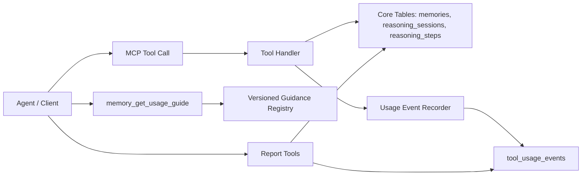

# Memory MCP Guidance And Telemetry Design

> **Trạng thái**: Draft
> **Cập nhật lần cuối**: 2026-07-06
> **Tạo bởi**: Codex
> **Nguồn chính**: `src/db.ts`, `src/migrations/index.ts`, `src/migrations/*.ts`, `src/tools/memory.ts`, `src/tools/reasoning.ts`, `src/schemas/reasoning.ts`, `AGENTS.md`, dữ liệu runtime trong SQLite local
> **Mức tin cậy tổng thể**: Trung bình
> **Phiên bản**: v0.1

## 1. Mục tiêu

Thiết kế một lớp hướng dẫn sử dụng có version và một lớp telemetry tối thiểu cho `memory-mcp-server`, để:

- agent có thể hỏi chính MCP cách dùng tool theo ngữ cảnh task;
- maintainer đo được hành vi thật của từng agent, client và MCP version;
- so sánh được hiệu quả adoption giữa các version;
- không phụ thuộc vào `AGENTS.md` như nguồn hướng dẫn duy nhất;
- không lưu prompt, full input/output hoặc dữ liệu nhạy cảm không cần thiết.

## 2. Bối cảnh và bằng chứng

### 2.1 Hiện trạng lưu trữ

Schema hiện tại đã chạy qua migration runner trong `src/migrations/index.ts`. `src/db.ts` chỉ mở SQLite, bật pragma và gọi `runMigrations(db)`. Hiện trạng DB gồm các nhóm dữ liệu chính sau:

| Bảng | Vai trò | Bằng chứng |
|---|---|---|
| `schema_migrations` | Track migration đã apply | `src/migrations/index.ts` |
| `memories` | Lưu durable memory | `src/migrations/0001_initial.ts` |
| `reasoning_sessions` | Lưu vòng đời reasoning session | `src/migrations/0001_initial.ts` |
| `reasoning_steps` | Lưu từng step trong session | `src/migrations/0001_initial.ts` |
| `reasoning_step_marks` | Lưu audit marks cho reasoning steps | `src/migrations/0002_reasoning_step_marks.ts` |
| `reasoning_steps_fts` | FTS index cho search reasoning steps | `src/migrations/0003_reasoning_steps_fts.ts` |

Hiện chưa có bảng riêng để lưu tool call telemetry, guidance version, adoption funnel hoặc event usage.

### 2.2 Hiện trạng hướng dẫn agent

`AGENTS.md` hiện có flow hướng dẫn agent sử dụng MCP. Đây là cải thiện hữu ích trong repo hiện tại, nhưng không đủ làm nguồn sự thật dài hạn vì:

| Vấn đề | Tác động |
|---|---|
| Phụ thuộc workspace | Agent dùng MCP ở repo khác có thể không đọc được hoặc không có cùng `AGENTS.md` |
| Dễ drift theo version | Tool behavior thay đổi nhưng hướng dẫn trong repo cũ không tự cập nhật |
| Không machine-readable | Agent khó chọn flow tự động nếu hướng dẫn chỉ là prose |
| Không đo được hiệu quả | Không biết agent có làm theo hướng dẫn hay không |

### 2.3 Hiện trạng đo hành vi

Qua quan sát DB runtime trước khi có telemetry, có thể suy luận một phần hành vi từ `reasoning_sessions` và `reasoning_steps`, nhưng không thể đo đầy đủ:

| Hành vi | Có đo được hiện tại? | Lý do |
|---|---:|---|
| Session được mở | Có | Có row trong `reasoning_sessions` |
| Step được thêm | Có | Có row trong `reasoning_steps` |
| Memory được lưu | Có | Có row trong `memories` |
| `memory_search` được gọi | Không | Read-only call không để lại event riêng |
| `memory_list` được gọi | Không | Read-only call không để lại event riêng |
| Tool call fail | Không đầy đủ | Error chỉ trả về response, không lưu event |
| Agent dùng version nào | Không | Không có `mcp_version` trong event |
| Memory có được recall và dùng thật không | Không | Không có usage event sau search/get |

## 3. Problem Statement

MCP hiện cung cấp tool memory và reasoning, nhưng agent chỉ nhìn thấy tool name, schema và description. Nếu không có workflow versioned nằm trong chính MCP, agent sẽ chỉ "biết tool tồn tại" chứ không chắc biết khi nào cần dùng tool nào.

Đồng thời, maintainer không có một nơi chuẩn để quan sát hành vi sử dụng theo từng agent và từng MCP version. Việc suy luận từ bảng `memories` hoặc `reasoning_sessions` là không đủ, vì các tool read-only và lỗi tool không để lại dấu vết bền vững.

## 4. Design Principles

1. MCP tự mô tả cách dùng chính nó.
2. Guidance phải có version và machine-readable.
3. Telemetry chỉ lưu metadata tối thiểu, không lưu full prompt hoặc full payload.
4. Mọi event phải local-first, hoạt động được với SQLite hiện tại.
5. Không phá tool contract hiện có.
6. Reporting phải trả lời được câu hỏi adoption trước khi thêm dashboard.
7. Metrics phải phân biệt agent, client và MCP version.
8. Giữ implementation nhỏ; không biến MCP thành analytics platform.

## 5. Scope

### 5.1 In Scope

| Hạng mục | Mô tả |
|---|---|
| Versioned guidance | Tool/resource để agent hỏi cách dùng MCP theo task context |
| Usage events | Bảng lưu event tối thiểu cho tool calls |
| Adoption reports | Tool read-only để tổng hợp funnel và behavior theo agent/version |
| Agent scorecard | Report so sánh cách từng agent dùng MCP |
| Privacy guardrails | Quy định dữ liệu nào được lưu và không được lưu |
| Migration plan | Schema additive để upgrade DB cũ an toàn |

### 5.2 Out Of Scope

| Hạng mục | Lý do loại trừ |
|---|---|
| Dashboard UI | Chưa cần trước khi có report tools |
| Cloud sync | MCP hiện là local-first |
| Vector search | Không liên quan trực tiếp đến telemetry/guidance |
| LLM scoring memory quality | Tăng độ phức tạp và rủi ro dữ liệu |
| Full prompt logging | Không phù hợp privacy và không cần để đo adoption |
| Tự động sửa hành vi agent | MCP chỉ hướng dẫn và đo, không kiểm soát agent runtime |

## 6. Target Architecture



Kiến trúc gồm bốn lớp:

| Lớp | Vai trò |
|---|---|
| Core memory/reasoning | Giữ nguyên tool hiện có và bảng hiện có |
| Versioned guidance | Trả workflow ngắn, có version, theo task context |
| Usage telemetry | Ghi event tối thiểu cho tool call |
| Reporting | Tổng hợp adoption, error, recall và behavior theo agent/version |

## 7. Tool Surface

### 7.1 Tool mới: `memory_get_usage_guide`

Purpose:

- Cho agent hỏi MCP cách dùng tool theo task hiện tại.
- Trả output ngắn, structured, có version.
- Giảm phụ thuộc vào `AGENTS.md`.

Expected input:

| Field | Type | Required | Ghi chú |
|---|---|---:|---|
| `task_type` | enum | Yes | `trivial`, `investigate`, `implement`, `debug`, `review`, `planning`, `handoff`, `unknown` |
| `agent_id` | string | No | Agent/persona đang gọi |
| `client_name` | string | No | Codex, Claude, custom agent |
| `client_version` | string | No | Version client nếu có |
| `mcp_version` | string | No | Nếu client biết version đang dùng |
| `has_prior_context_query` | boolean | No | Agent đã có query cụ thể để search memory chưa |
| `is_sensitive_task` | boolean | No | Task có dữ liệu nhạy cảm hoặc secret không |

Expected output:

| Field | Type | Mô tả |
|---|---|---|
| `guide_version` | string | Version của guidance |
| `mcp_version` | string | Version MCP đang phục vụ guidance |
| `recommended_flow` | string[] | Danh sách bước ngắn, machine-readable |
| `first_tool` | string \| null | Tool nên gọi đầu tiên |
| `required_tools` | string[] | Tool nên dùng nếu flow tiếp tục |
| `avoid_tools` | string[] | Tool không nên dùng trong context này |
| `save_policy` | object | Khi nào save/skip memory |
| `telemetry_notice` | string | Nhắc rằng call có thể được ghi event metadata |

Example output:

```json
{
  "guide_version": "2026-07-05.v1",
  "mcp_version": "1.1.0",
  "recommended_flow": [
    "memory_search if prior context could change the answer",
    "reasoning_start_session before multi-step investigation",
    "reasoning_add_step only for meaningful decisions or observations",
    "reasoning_complete_session at the end",
    "save durable conclusions unless memory_mode is never"
  ],
  "first_tool": "memory_search",
  "required_tools": ["reasoning_start_session", "reasoning_complete_session"],
  "avoid_tools": [],
  "save_policy": {
    "default": "save_completed_durable_conclusion",
    "skip_requires_reason": true
  },
  "telemetry_notice": "This MCP stores tool usage metadata, not full prompts or full payloads."
}
```

### 7.2 Tool mới: `memory_usage_report`

Purpose:

- Tổng hợp tool usage theo agent, client, MCP version và thời gian.

Expected input:

| Field | Type | Required |
|---|---|---:|
| `agent_id` | string | No |
| `client_name` | string | No |
| `mcp_version` | string | No |
| `date_from` | ISO date/time | No |
| `date_to` | ISO date/time | No |
| `group_by` | enum | No |
| `limit` | number | No |

Supported `group_by`:

- `tool_name`
- `agent_id`
- `client_name`
- `mcp_version`
- `operation_type`
- `status`
- `day`

Expected output:

| Field | Mô tả |
|---|---|
| `summary` | Tổng số event, success rate, error rate |
| `groups` | Bảng aggregate theo `group_by` |
| `top_errors` | Error code/message đã normalize |
| `time_range` | Khoảng dữ liệu được tính |

### 7.3 Tool mới: `memory_adoption_report`

Purpose:

- Đo funnel memory adoption và reasoning completion.

Metrics bắt buộc:

| Metric | Mô tả |
|---|---|
| `reasoning_started` | Số session được mở |
| `reasoning_completed` | Số session completed |
| `reasoning_abandoned` | Số session abandoned |
| `zero_step_sessions` | Session có 0 step |
| `completed_with_memory` | Session complete có tạo memory |
| `completed_without_memory` | Session complete không tạo memory |
| `skip_reason_count` | Số lần skip theo reason |
| `memory_saved` | Số memory được tạo |
| `memory_searched` | Số lần search/list/get |
| `memory_recalled` | Số memory xuất hiện trong search/get result |
| `memory_updated` | Số lần memory được curate |

Expected output:

| Field | Mô tả |
|---|---|
| `funnel` | Tỷ lệ chuyển đổi giữa các bước |
| `agent_breakdown` | Breakdown theo agent |
| `version_breakdown` | Breakdown theo MCP version |
| `risk_flags` | Các dấu hiệu bất thường |

### 7.4 Tool mới: `memory_agent_scorecard`

Purpose:

- Cho maintainer xem từng agent đang dùng MCP ra sao.

Expected output per agent:

| Field | Mô tả |
|---|---|
| `agent_id` | Agent/persona |
| `sessions_started` | Số session mở |
| `sessions_completed` | Số session đóng |
| `avg_steps_per_session` | Độ sâu trace trung bình |
| `save_rate` | Tỷ lệ completed session có memory |
| `search_rate` | Mức dùng memory retrieval |
| `reuse_rate` | Memory saved có được recall lại không |
| `error_rate` | Tỷ lệ lỗi tool |
| `dominant_behavior` | Ví dụ: `reasoning-heavy`, `memory-light`, `balanced`, `noisy` |
| `recommendations` | Gợi ý cải thiện behavior |

### 7.5 Tool mới: `memory_record_usage_feedback`

Purpose:

- Cho agent hoặc client ghi feedback tối thiểu sau khi một memory/search result được dùng.
- Đây là cách đo `memory_search -> memory_used`, thay vì chỉ biết search có trả kết quả.

Expected input:

| Field | Type | Required | Ghi chú |
|---|---|---:|---|
| `memory_id` | string | Yes | Memory được dùng |
| `event_id` | string | No | Event search/get liên quan |
| `agent_id` | string | No | Agent dùng memory |
| `usefulness` | enum | Yes | `used`, `ignored`, `irrelevant`, `stale`, `unsafe_to_use` |
| `reason` | string | No | Lý do ngắn, không chứa secret |

Expected behavior:

- Ghi event với `operation_type='feedback'`.
- Không sửa nội dung memory.
- Không yêu cầu full task context.

## 8. Data Model

### 8.1 Bảng mới: `tool_usage_events`

Suggested columns:

| Column | Type | Required | Mô tả |
|---|---|---:|---|
| `id` | TEXT PRIMARY KEY | Yes | Event id |
| `created_at` | TEXT | Yes | ISO timestamp |
| `agent_id` | TEXT | No | Agent/persona |
| `client_name` | TEXT | No | Codex, Claude, custom |
| `client_version` | TEXT | No | Version client |
| `mcp_version` | TEXT | Yes | Version MCP |
| `guidance_version` | TEXT | No | Guidance version nếu có |
| `tool_name` | TEXT | Yes | Tool được gọi |
| `operation_type` | TEXT | Yes | `memory`, `reasoning`, `guidance`, `report`, `feedback` |
| `access_type` | TEXT | Yes | `read`, `write`, `delete`, `derived` |
| `status` | TEXT | Yes | `success`, `error`, `skipped` |
| `error_code` | TEXT | No | Error normalize |
| `latency_ms` | INTEGER | No | Thời gian xử lý |
| `session_id` | TEXT | No | Session liên quan |
| `step_id` | TEXT | No | Step liên quan |
| `memory_id` | TEXT | No | Memory chính liên quan |
| `related_event_id` | TEXT | No | Link tới event trước đó |
| `input_shape` | TEXT | No | JSON metadata đã sanitize |
| `output_shape` | TEXT | No | JSON metadata đã sanitize |
| `metadata` | TEXT | No | JSON object tối thiểu |

Suggested constraints:

| Constraint | Lý do |
|---|---|
| `status IN ('success','error','skipped')` | Chuẩn hóa report |
| `access_type IN ('read','write','delete','derived')` | Phân biệt side-effect |
| `operation_type IN (...)` | Phân nhóm behavior |

Suggested indexes:

| Index | Mục đích |
|---|---|
| `(created_at)` | Filter thời gian |
| `(agent_id, created_at)` | Report theo agent |
| `(mcp_version, created_at)` | So sánh version |
| `(tool_name, created_at)` | Tool usage report |
| `(status, created_at)` | Error report |
| `(session_id)` | Join với reasoning |
| `(memory_id)` | Join với memory |

### 8.2 Bảng mới: `guidance_versions`

Suggested columns:

| Column | Type | Required | Mô tả |
|---|---|---:|---|
| `version` | TEXT PRIMARY KEY | Yes | Guidance version |
| `mcp_version` | TEXT | Yes | MCP version được bundle |
| `content_hash` | TEXT | Yes | Hash nội dung guidance |
| `created_at` | TEXT | Yes | Ngày tạo |
| `status` | TEXT | Yes | `active`, `deprecated` |
| `metadata` | TEXT | No | JSON metadata |

Lưu ý: v1 có thể hardcode guidance trong code và chỉ expose `guide_version`; bảng này chỉ cần khi guidance cần inspect/history trong DB.

### 8.3 Bảng mới: `memory_usage_feedback`

Có hai lựa chọn:

| Option | Mô tả | Khuyến nghị |
|---|---|---|
| Reuse `tool_usage_events` | Lưu feedback như event `operation_type='feedback'` | Khuyến nghị v1 |
| Bảng riêng | Tối ưu query feedback riêng | Chỉ thêm khi query feedback phức tạp |

V1 nên dùng `tool_usage_events` để giữ schema nhỏ.

## 9. Event Taxonomy

### 9.1 Operation Types

| operation_type | Tools |
|---|---|
| `memory` | `memory_save`, `memory_search`, `memory_list`, `memory_get`, `memory_update`, `memory_delete` |
| `reasoning` | `reasoning_start_session`, `reasoning_add_step`, `reasoning_get_trace`, `reasoning_list_sessions`, `reasoning_mark_step`, `reasoning_search_steps`, `reasoning_list_milestones`, `reasoning_get_session_outline`, `reasoning_complete_session` |
| `guidance` | `memory_get_usage_guide` |
| `report` | `memory_usage_report`, `memory_adoption_report`, `memory_agent_scorecard` |
| `feedback` | `memory_record_usage_feedback` |

### 9.2 Input Shape Rules

`input_shape` không lưu full input. Chỉ lưu các thuộc tính đã sanitize:

| Tool | input_shape nên lưu |
|---|---|
| `memory_search` | query length, query term count, filters present, limit |
| `memory_save` | content length, type, tag count, importance |
| `memory_update` | updated fields list, patch vs replace |
| `reasoning_add_step` | fields present, text lengths |
| `reasoning_mark_step` | mark_type, note present, note length |
| `reasoning_search_steps` | query length, token count, filters present, limit |
| `reasoning_list_milestones` | filters present, limit |
| `reasoning_get_session_outline` | session_id present |
| `reasoning_complete_session` | status, memory_mode, saved/skipped |
| `memory_get_usage_guide` | task_type, agent_id present, client_name |

### 9.3 Output Shape Rules

`output_shape` chỉ lưu summary:

| Tool | output_shape nên lưu |
|---|---|
| `memory_search` | result count, has_more, returned ids hash/list optional |
| `memory_list` | result count, has_more |
| `memory_get` | found/not found |
| `memory_save` | memory_id, type, tag count |
| `reasoning_start_session` | session_id |
| `reasoning_mark_step` | step_id, mark_type, note present |
| `reasoning_search_steps` | result count |
| `reasoning_list_milestones` | result count, has_more |
| `reasoning_get_session_outline` | used_fallback, step count |
| `reasoning_complete_session` | memory_id present, not_saved_reason category, warning count |
| report tools | row count, date range |

## 10. Reporting Semantics

### 10.1 Adoption Funnel


Primary funnel metrics:

| Funnel Step | Công thức |
|---|---|
| Start to complete | `completed_sessions / started_sessions` |
| Complete to memory | `completed_with_memory / completed_sessions` |
| Memory recall | `memories_recalled / memories_saved` |
| Recall usefulness | `feedback_used / recalled_memories` |
| Trace depth | `avg(reasoning_steps per session)` |
| Compliance-only sessions | `zero_step_sessions / started_sessions` |

### 10.2 Version Comparison

Report phải hỗ trợ so sánh theo `mcp_version`:

| Câu hỏi | Metric |
|---|---|
| Version mới có tăng save rate không? | `completed_with_memory / completed_sessions` |
| Version mới có giảm zero-step session không? | `zero_step_sessions / started_sessions` |
| Version mới có làm tool lỗi nhiều hơn không? | `error_events / total_events` |
| Guidance mới có được gọi không? | `memory_get_usage_guide count` |
| Guidance mới có cải thiện behavior không? | Compare funnel before/after guidance event |

### 10.3 Agent Behavior Categories

`memory_agent_scorecard` có thể phân loại agent bằng rule đơn giản:

| Category | Điều kiện gợi ý |
|---|---|
| `reasoning-heavy` | session nhiều, memory save thấp |
| `memory-light` | search/save thấp so với task count |
| `balanced` | reasoning completion và memory save đều ổn |
| `compliance-only` | nhiều zero-step hoặc one-step sessions |
| `search-only` | search nhiều nhưng feedback/use thấp |
| `noisy-writer` | save nhiều nhưng recall/use thấp |
| `error-prone` | error rate cao |

## 11. Privacy And Safety Rules

### 11.1 Không lưu

Telemetry không được lưu:

- full prompt;
- full tool input;
- full tool output;
- content của memory;
- nội dung `thought`, `action`, `observation`;
- secret, token, password, credential;
- raw personal data không cần thiết;
- file content hoặc code snippets.

### 11.2 Được lưu

Telemetry được lưu:

- IDs nội bộ (`session_id`, `step_id`, `memory_id`);
- length/count/boolean flags;
- enum values;
- status/error code;
- MCP/client/agent version;
- latency;
- tag count, result count;
- sanitized metadata.

### 11.3 Retention

V1 nên có chính sách retention đơn giản:

| Loại event | Retention gợi ý |
|---|---|
| Tool usage events | 90 ngày mặc định |
| Aggregated reports | Không cần cache ở v1 |
| Feedback events | 180 ngày nếu dùng để đánh giá quality |
| Error events | 180 ngày |

Nếu chưa implement cleanup tool trong v1, spec implementation phải ghi rõ telemetry sẽ tăng DB size theo thời gian.

## 12. Migration Strategy

### 12.1 Required Migrations

Migration foundation đã tồn tại trong branch hiện tại. Telemetry/guidance chỉ cần mở rộng migration set hiện có, không cần thêm lại `schema_migrations` hay baseline runner.

Suggested migration order:

| Migration | Nội dung |
|---|---|
| `0004_tool_usage_events` | Thêm `tool_usage_events` và indexes |
| `0005_guidance_versions` | Optional, chỉ nếu cần DB-backed guidance registry |

### 12.2 Backward Compatibility

Rules:

- Không đổi ý nghĩa bảng `memories`, `reasoning_sessions`, `reasoning_steps`.
- Event recorder fail thì không làm fail tool chính, trừ khi DB corruption nghiêm trọng.
- Nếu telemetry insert lỗi, tool chính vẫn trả response nhưng có thể log stderr.
- Existing clients không cần truyền `client_name` hoặc `client_version`.

## 13. Implementation Plan

### Phase 1. Extend Existing Migrations

Deliverables:

- `0004_tool_usage_events`;
- indexes cho query adoption/report;
- test fresh DB và existing DB upgrade từ `0001`-`0003`.

Reason:

- Telemetry cần schema mới; branch hiện tại đã có migration runner nên thay đổi nên tiếp tục theo hướng additive thay vì quay lại inline `CREATE TABLE IF NOT EXISTS`.

### Phase 2. Usage Event Capture

Deliverables:

- helper `recordToolUsageEvent`;
- wrapper hoặc call-site instrumentation cho từng tool handler;
- bảng `tool_usage_events`;
- event sanitize functions cho input/output shape;
- không lưu full payload.

Minimal instrumentation:

- start timestamp;
- execute handler;
- derive status/error;
- derive ids từ output nếu có;
- insert event best-effort.

### Phase 3. Versioned Guidance

Deliverables:

- `memory_get_usage_guide`;
- `guide_version` constant;
- task-type decision table;
- telemetry event cho mỗi guidance request.

Guidance v1 phải ngắn, structured và deterministic. Không dùng LLM trong MCP.

### Phase 4. Reporting Tools

Deliverables:

- `memory_usage_report`;
- `memory_adoption_report`;
- `memory_agent_scorecard`;
- date range filters;
- group-by filters;
- pagination hoặc limit.

### Phase 5. Feedback Loop

Deliverables:

- `memory_record_usage_feedback`;
- metric `memory_search -> used`;
- report usefulness/staleness.

### Phase 6. Retention And Cleanup

Deliverables:

- retention config;
- optional cleanup tool hoặc startup cleanup;
- report DB size / event counts.

## 14. Validation Plan

### 14.1 Automated Coverage

Minimum tests:

| Test | Expected |
|---|---|
| Fresh DB migration | Tables and indexes exist |
| Existing DB upgrade | Existing memories/sessions remain readable |
| Tool success event | Successful tool call creates event |
| Tool error event | Failed tool call creates event with `status='error'` |
| Read-only event | `memory_search` creates telemetry event |
| Audit read-only event | `reasoning_search_steps` và `reasoning_get_session_outline` tạo telemetry event |
| Audit write-lite event | `reasoning_mark_step` tạo telemetry event |
| Sanitization | Full prompt/content is not stored |
| Guidance output | `memory_get_usage_guide` returns stable versioned structure |
| Report accuracy | Aggregates match seeded events |
| Best-effort telemetry failure | Tool main result still succeeds if event insert fails |

### 14.2 Manual Smoke

Manual flow:

1. Start MCP with empty DB.
2. Call `memory_get_usage_guide` for `task_type='debug'`.
3. Start reasoning session.
4. Add one step.
5. Mark step bằng `reasoning_mark_step`.
6. Query audit surface bằng `reasoning_search_steps`, `reasoning_list_milestones` và `reasoning_get_session_outline`.
7. Complete session with auto-save.
8. Search memory.
9. Record feedback `used`.
10. Run `memory_adoption_report`.
11. Confirm report shows both reasoning funnel và audit-tool usage.

## 15. Risks

| Risk | Tác động | Mitigation |
|---|---|---|
| Telemetry quá rộng | DB phình, khó bảo trì | Chỉ lưu metadata tối thiểu |
| Guidance quá dài | Agent bỏ qua | Output ngắn, structured |
| Sensitive data leak | Rủi ro nghiêm trọng | Sanitization bắt buộc, không full payload |
| Report sai do thiếu event | Sai quyết định version | Instrument tất cả tool handler |
| Version attribution thiếu | Không so sánh được release | `mcp_version` bắt buộc trong event |
| Telemetry insert làm tool fail | Giảm reliability | Best-effort event recording |
| Drift giữa guidance và code | Agent dùng sai flow | Guidance version bundle cùng MCP version |

## 16. Open Questions

| ID | Câu hỏi | Impact | Cần xác nhận bởi | Ghi chú |
|---|---|---|---|---|
| Q-001 | `mcp_version` lấy từ package version hay constant build-time? | Ops | Maintainer | Nên tránh đọc package JSON runtime nếu không cần |
| Q-002 | Có cần config tắt telemetry hoàn toàn không? | Compliance | User/Maintainer | Khuyến nghị có `MEMORY_TELEMETRY=off` |
| Q-003 | Có cần lưu `client_name` bắt buộc không? | Ops | User/Maintainer | Client có thể không truyền |
| Q-004 | Feedback `memory_record_usage_feedback` do agent tự gọi hay client tự gọi? | Scope | User/Maintainer | Nếu agent tự gọi thì adoption phụ thuộc prompt |
| Q-005 | Retention mặc định bao lâu? | Ops | User/Maintainer | Gợi ý 90 ngày cho usage events |

## 17. Recommendation

Proceed theo thứ tự:

1. Mở rộng migration set hiện có bằng telemetry tables.
2. Thêm `tool_usage_events` và best-effort event recorder.
3. Thêm `memory_get_usage_guide` để MCP tự hướng dẫn agent.
4. Thêm report tools để đo adoption theo agent/version, bao gồm audit-tool usage.
5. Thêm feedback loop sau khi basic telemetry đã ổn.

Lý do: migration foundation đã có sẵn, nên bước nhỏ nhất đúng là nối tiếp schema hiện tại. Telemetry vẫn phải đi trước dashboard hoặc tuning behavior; nếu không có event store, mọi kết luận về agent behavior vẫn chỉ là suy luận gián tiếp từ memory/session tables và không phản ánh audit-surface adoption.

## 18. Các điểm chưa xác nhận

| # | Phát hiện | Section | Marker | Cần xác nhận bởi | Ghi chú |
|---|---|---|---|---|---|
| 1 | Retention mặc định 90 ngày | 11.3 | [NEEDS-CONFIRMATION] | User/Maintainer | Chưa có yêu cầu vận hành cụ thể |
| 2 | `guidance_versions` có cần là bảng riêng trong v1 không | 8.2 | [NEEDS-CONFIRMATION] | Maintainer | Có thể hardcode guidance trong code ở v1 |
| 3 | Feedback memory do agent hay client gọi | 16 | [NEEDS-CONFIRMATION] | User/Maintainer | Ảnh hưởng adoption của `memory_record_usage_feedback` |
| 4 | Telemetry opt-out env var | 16 | [NEEDS-CONFIRMATION] | User/Maintainer | Khuyến nghị có để giảm rủi ro compliance |
